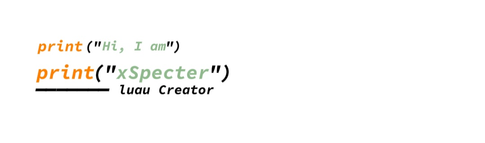

<h1 align="center">Hi, I'm xStrikea!</h1>

  

  
  

---

## 🚀 About Me

- Passionate about **Roblox game development**, scripting, and UI/UX design  
- Currently creating tools like **Super Ring Parts** and **Script Playground**
- Exploring HTML, Lua, GSAP, and API integrations

---

## 🧰 Tech Stack

  
  
  
  
  

---

## 📦 Projects

| Project            | Description                                             | Status   |
|--------------------|---------------------------------------------------------|----------|
| **Super Ring Parts** | Physics-based Roblox tool with GUI control            | ✅ Active |
| **Godmode** | Makes the player invincible | ✅ Active |

---

## 📊 GitHub Stats

  
  
  

---

## 🌐 Connect With Me

  
  

---
